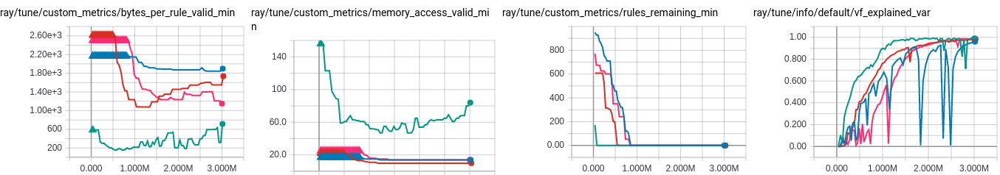

# NeuroCuts

NeuroCuts is a deep RL algorithm for generating optimized packet classification trees. See the [preprint](https://arxiv.org) for an overview.

## Running NeuroCuts

You can train a NeuroCuts policy for a small rule set using the following command, which should converge in less than 100k timesteps:
```
python run_neurocuts.py --rules=acl1_seed_1000 --fast
```

To monitor training progress, open `tensorboard --logdir=~/ray-results` and navigate to the web UI. The important metrics to pay attention to are `rules_remaining_min` (this must reach zero to be considered a "valid" tree), `memory_access_valid_min` (access time metric for valid trees), `bytes_per_rule_valid_min` (bytes per rule metric for valid trees), and `vf_explained_var` (this approaches 1 as the policy converges):



To kick off a full-scale training run, pass in a comma separated list of rule file names from the `classbench` directory and overrides for other hyperparameters. Example:

```
python run_neurocuts.py --rules=acl1_seed_10000,fw1_seed_10000 \
    --partition-mode=efficuts \
    --dump-dir=/tmp/trees --num-workers=8 --gpu
```

## Inspecting trees

You can visualize and check the state of generated trees by running `inspect_tree.py <file>`. This requires that you specify the `--dump-dir` option when running NeuroCuts training.

## Running baselines

You can run the HiCuts, HyperCuts, EffiCuts, and CutSplit baselines using `run_baselines.py`.
